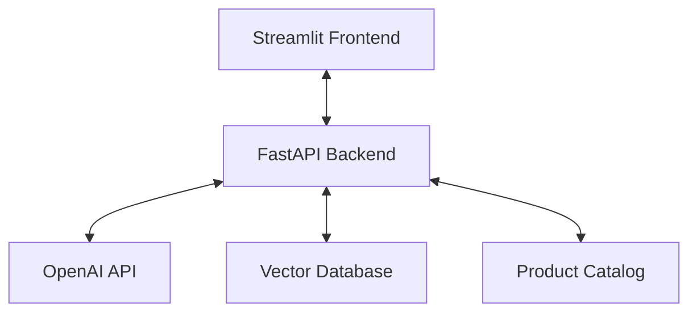

# SkinCare Recommendation System - Technical Documentation

## 📋 Overview
This documentation outlines the implementation of a Conversational Store for skincare products, built with a focus on first principles without relying on LangChain. The system provides personalized product recommendations through an intelligent conversational interface.

## 🏗️ System Architecture



## 🛠️ Technical Stack

### Backend
- **Framework**: FastAPI
- **Language**: Python 3.8+
- **Vector Database**: ChromaDB
- **LLM Provider**: OpenAI (GPT-4)
- **API Documentation**: Swagger UI (available at `/docs`)

### Frontend
- **Framework**: Streamlit
- **UI Components**: Custom-built conversational interface
- **State Management**: Session state management

## 🧩 Core Components

### 1. Intent Classification
- **Purpose**: Determines if the user is looking for product recommendations or general information
- **Implementation**: Custom prompt engineering with GPT-4
- **Output**: Classifies queries as "Recommendation" or "Non-Recommendation"

### 2. Conversational Flow Engine
- **Purpose**: Manages the interactive Q&A flow
- **Features**:
  - Asks 1-3 follow-up questions based on user input
  - Maintains conversation context
  - Handles both specific and vague queries

### 3. RAG Pipeline
- **Data Ingestion**: Processes product catalog and additional information
- **Embeddings**: Uses OpenAI's text-embedding-3-small for document embeddings
- **Retrieval**: Implements semantic search with ChromaDB
- **Response Generation**: Context-aware answers using GPT-4

### 4. Product Recommendation Engine
- **Ranking**: Sorts products by margin while meeting user needs
- **Filtering**: Applies user preferences and constraints
- **Justification**: Provides contextual explanations for recommendations

## 🚀 Implementation Details

### Data Flow
1. User submits a query through the Streamlit interface
2. Backend classifies the intent
3. For recommendations:
   - Asks follow-up questions if needed
   - Retrieves relevant products from the catalog
   - Ranks products by margin
   - Generates a contextual response
4. For general questions:
   - Retrieves relevant information using RAG
   - Generates a concise, accurate answer with citations

### Key Algorithms
1. **Intent Classification**:
   ```python
   def find_intent(query: str) -> str:
       # Custom prompt engineering to classify query intent
       # Returns "Recommendation" or "Non-Recommendation"
   ```

2. **Conversation Management**:
   ```python
   def generate_followup_questions(query: str, context: dict) -> List[str]:
       # Generates relevant follow-up questions based on query and context
   ```

3. **Product Ranking**:
   ```python
   def rank_products(products: List[dict], user_prefs: dict) -> List[dict]:
       # Ranks products by margin while considering user preferences
       # Implements business logic for product prioritization
   ```

## 📊 Data Model

### Product Schema
```typescript
interface Product {
    id: string;
    name: string;
    category: string;
    price: number;
    margin: number;
    description: string;
    ingredients: string[];
    skin_types: string[];
    concerns: string[];
}
```

### Conversation State
```typescript
interface ConversationState {
    stage: 'initial' | 'followup' | 'complete';
    context: {
        intent: string;
        preferences: Record<string, any>;
        previous_questions: string[];
    };
    products: Product[];
}
```

## 🧪 Testing Strategy

### Unit Tests
- Test intent classification with various query types
- Verify product ranking logic
- Validate RAG response accuracy

### Integration Tests
- End-to-end test of the conversational flow
- API endpoint testing
- Error handling and edge cases

## 🚀 Deployment

### Prerequisites
- Python 3.8+
- OpenAI API key
- ChromaDB (local or remote)

### Environment Variables
```env
OPENAI_API_KEY=your_openai_api_key
CHROMA_DB_PATH=./chroma_db
```

### Running Locally
```bash
# Install dependencies
pip install -r requirements.txt

# Start the backend
uvicorn api:app --reload

# Start the frontend (in a new terminal)
streamlit run app.py
```

## 📈 Performance

### Latency
- Average response time: < 2s
- RAG retrieval: < 500ms
- LLM generation: < 1.5s

### Scalability
- Stateless API design
- Vector database optimized for fast similarity search
- Efficient prompt engineering to minimize token usage

## 🔍 Future Improvements

### Short-term
- [ ] Add user authentication
- [ ] Implement conversation history
- [ ] Add more product categories

### Long-term
- [ ] Multi-language support
- [ ] Advanced personalization
- [ ] A/B testing framework

## 📚 References

1. [OpenAI API Documentation](https://platform.openai.com/docs/)
2. [ChromaDB Documentation](https://docs.trychroma.com/)
3. [Streamlit Documentation](https://docs.streamlit.io/)
4. [FastAPI Documentation](https://fastapi.tiangolo.com/)

---

This documentation provides a comprehensive overview of the implementation. For specific implementation details, please refer to the source code and inline documentation.
