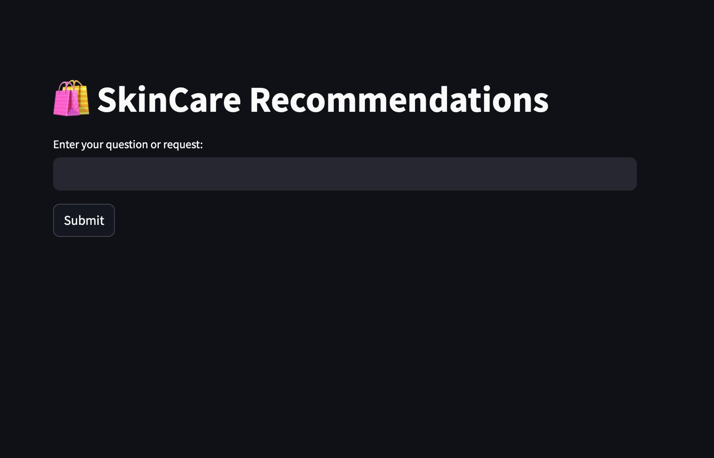
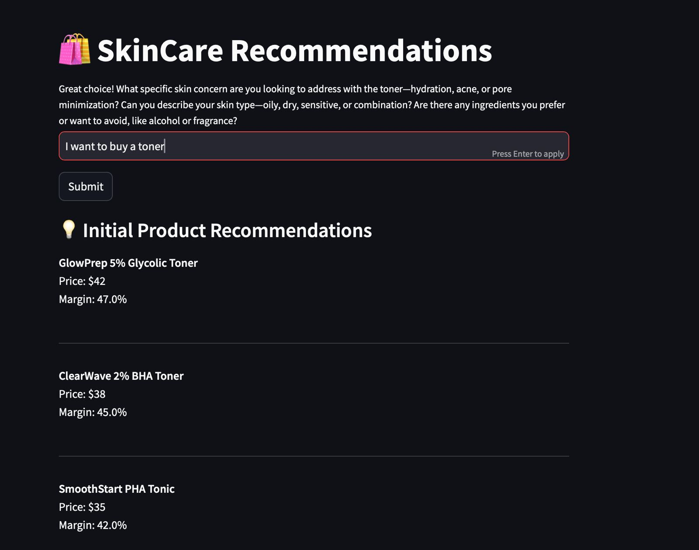
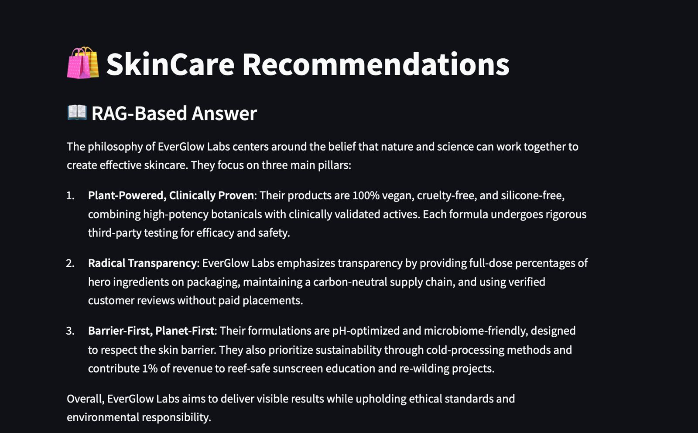
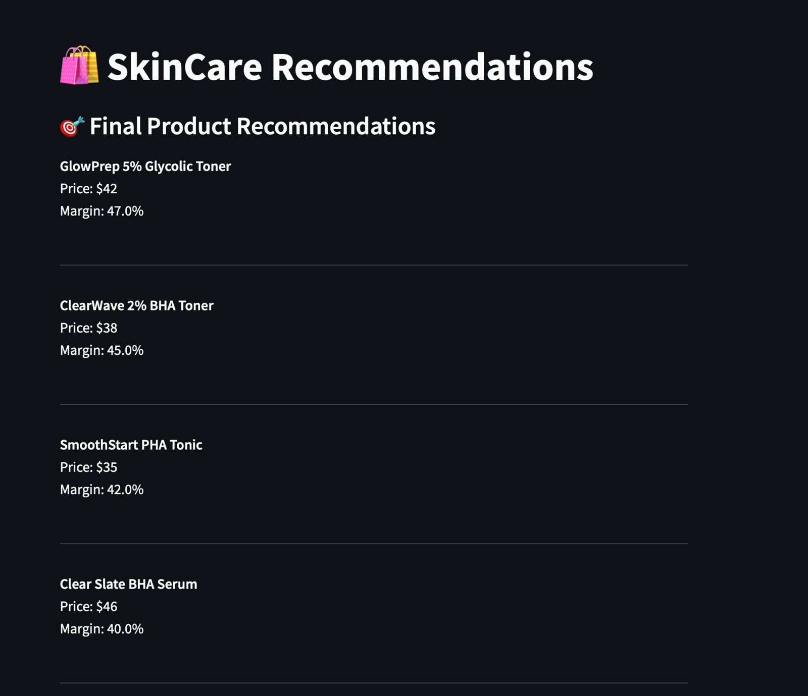

<div align="center">
  <h1>✨ SkinCare Recommendation System</h1>
  <p>A powerful AI-powered skincare recommendation system that helps users find the perfect skincare products based on their needs and preferences.</p>
  
  
  
  [](https://opensource.org/licenses/MIT)
  [](https://www.python.org/downloads/)
  [](https://github.com/psf/black)
</div>

## 🚀 Features

<div align="center">
  
</div>

### ✨ Application Flow

| Feature | Screenshot |
|---------|------------|
| **Home Page** |  |
| **Interactive Q&A** |  |
| **RAG Answers** |  |
| **Final Recommendations** |  |

## 📸 Screenshots

<div align="center">
  
  
  
  
</div>


## 🛠️ Prerequisites

- Python 3.8+
- pip (Python package manager)
- OpenAI API key

## 🚀 Quick Start

1. **Clone the repository**
   ```bash
   git clone https://github.com/yourusername/skincare-recommendation-system.git
   cd skincare-recommendation-system
   ```

2. **Create and activate a virtual environment**
   ```bash
   # On macOS/Linux
   python3 -m venv venv
   source venv/bin/activate

   # On Windows
   python -m venv venv
   .\venv\Scripts\activate
   ```

3. **Install dependencies**
   ```bash
   pip install -r requirements.txt
   ```

4. **Set up environment variables**
   Create a `.env` file in the root directory with your OpenAI API key:
   ```
   OPENAI_API_KEY=your_openai_api_key_here
   ```

5. **Start the application**
   ```bash
   # Start the FastAPI backend
   uvicorn api:app --reload --port 8000

   # In a new terminal, start the Streamlit frontend
   streamlit run app.py
   ```

6. **Access the application**
   - Frontend: http://localhost:8501
   - API Docs: http://localhost:8000/docs

## 📂 Project Structure

```
skincare-recommendation-system/
├── api.py               # FastAPI backend
├── app.py               # Streamlit frontend
├── utils.py             # Core functionality
├── requirements.txt     # Python dependencies
├── .env.example        # Example environment variables
├── photos/             # Directory for all images and screenshots
│   ├── HomePage.jpeg            # Main application home page
│   ├── IntermediateQuestions.jpeg  # Screenshot of interactive Q&A
│   ├── RAGAnswer.jpeg           # Example of RAG-powered response
│   └── FinalRecommendations.jpeg  # Final product recommendations
└── README.md           # This file
```

### Adding New Images

1. Place your images in the `photos/` directory
2. Reference them in the README using:
   ```markdown
   
   ```
3. For better organization, use descriptive filenames (e.g., `feature-overview.png`)
4. Recommended image dimensions:
   - Screenshots: 1200x800px
   - Icons/Logos: 200x200px
   - Feature examples: 400x300px

## 🌟 API Endpoints

- `POST /api/intent` - Classify user query intent
- `POST /api/recommendation/questions` - Get follow-up questions for recommendations
- `POST /api/recommendation/final` - Get final recommendation based on user input
- `POST /api/rag` - Get RAG-based responses
- `POST /api/products` - Search for products (requires implementation)

## 🔧 Environment Variables

| Variable | Description | Required |
|----------|-------------|----------|
| `OPENAI_API_KEY` | Your OpenAI API key | Yes |

## 🤝 Contributing

We welcome contributions! Here's how you can help:

1. Fork the repository
2. Create your feature branch (`git checkout -b feature/AmazingFeature`)
3. Add your images to the `photos/` directory
4. Update the README with your changes
5. Commit your changes (`git commit -m 'Add some AmazingFeature'`)
6. Push to the branch (`git push origin feature/AmazingFeature`)
7. Open a Pull Request

### Image Guidelines

- Use PNG format for screenshots and JPG for photos
- Optimize images for web (recommend tools: [TinyPNG](https://tinypng.com/))
- Keep file sizes under 500KB
- Use descriptive filenames (e.g., `main-interface-dark-mode.png`)
- Update the README to reference new images

## 📄 License

This project is licensed under the MIT License - see the [LICENSE](LICENSE) file for details.

## 🙏 Acknowledgments

- OpenAI for their powerful language models
- Streamlit for the amazing UI framework
- FastAPI for the high-performance backend
- The open-source community for inspiration and support
